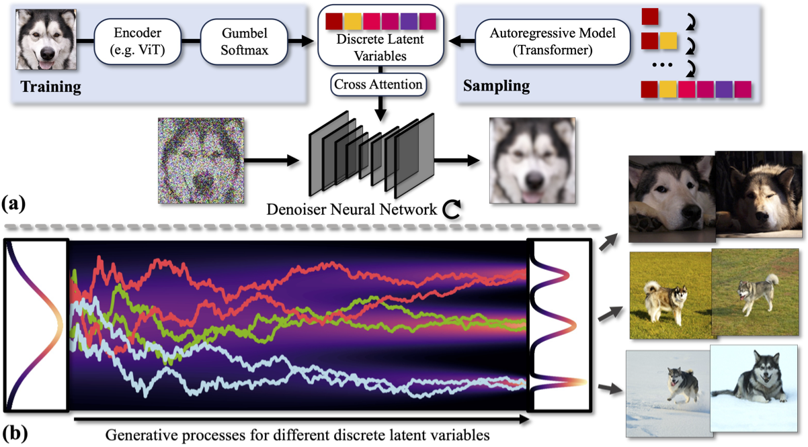
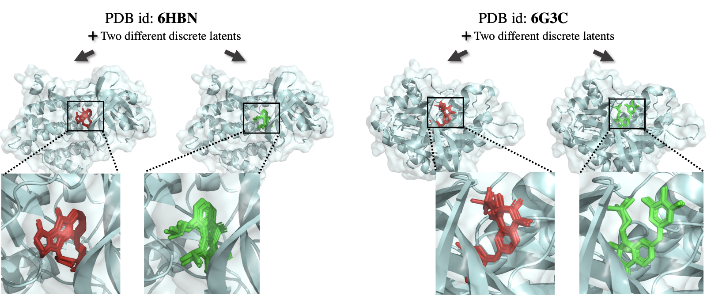

# DisCo-DiffDock

Code for the molecular docking experiments from the paper [DisCo-Diff: Enhancing Continuous Diffusion Models with Discrete Latents](https://yilun-xu.com/disco-diff.github.io/) by Yilun Xu, Gabriele Corso, Tommi Jaakkola, Arash Vahdat and Karsten Kreis. 





This repository was forked from the original [DiffDock 1.0 repository](https://github.com/gcorso/DiffDock/tree/bc6b5151457ea5304ee69779d92de0fded599a2c). Please refer to the original repository for details on how to set up the environment and download the data required for training.

## Commands to replicate the docking experimental results

### Run the baseline DiffDock-S inference
```
python -m evaluate --model_dir workdir/diffdockS_score_model --data_dir data/PDBBind_processed --run_name TEST_diffdockS --tqdm --split data/splits/timesplit_test --num_workers 1 --esm_embeddings_path data/esm2_embeddings.pt --samples_per_complex 40 --cache_path cache --batch_size 10 --no_final_step_noise --actual_steps 20 --confidence_ckpt best_model_epoch75.pt --confidence_model_dir workdir/paper_confidence_model --limit_complexes 0 --inference_steps 20 --oracle --temp_psi_rot=2.686505606141324 --temp_psi_tor=4.089493860493927 --temp_psi_tr=0.07085125444659945 --temp_sampling_rot=5.659562317960644 --temp_sampling_tor=2.8888668488630156 --temp_sampling_tr=1.886430780895051 --temp_sigma_data_rot=0.7437588205919711 --temp_sigma_data_tor=0.08897393057297842 --temp_sigma_data_tr=0.3617563913086843 --batch_size 40
```

### Run DisCo-DiffDock-S inference
```
python -m evaluate --ar_ckpt=best_model_loss.pt --ar_model_dir=workdir/disco_diffdockS_ar_model --batch_size=40 --cache_path=cache --ckpt_score=best_ema_inference_epoch_model.pt --confidence_ckpt=best_model_epoch75.pt --confidence_model_dir=workdir/paper_confidence_model --data_dir=data/PDBBind_processed --esm_embeddings_path=data/esm2_embeddings.pt --inference_steps=20 --log_softmax_latent_temperature=-1.5 --model_dir=workdir/disco_diffdockS_score_model --no_final_step_noise --run_name=TEST_disco_diffdockS --samples_per_complex=40 --split=data/splits/timesplit_test --temp_psi_rot=1.2760150490206228 --temp_psi_tor=2.0625243924678136 --temp_psi_tr=1.2685697872473618 --temp_sampling_rot=4.005218254154881 --temp_sampling_tor=3.6499018519649384 --temp_sampling_tr=1.546842681537956 --temp_sigma_data_rot=0.453446580767075 --temp_sigma_data_tor=0.3292199987743284 --temp_sigma_data_tr=0.8456140350087653 
```


### Run DisCo-DiffDock-S encoder + denoiser training
```
python -m train --run_name disco_diffdockS_score_model --test_sigma_intervals --esm_embeddings_path data/esm2_embeddings.pt --cache_path cache --log_dir workdir --lr 1e-3 --tr_sigma_min 0.1 --tr_sigma_max 19 --rot_sigma_min 0.03 --rot_sigma_max 1.55 --tor_sigma_min 0.03 --batch_size 24 --ns 24 --nv 6 --num_conv_layers 5 --dynamic_max_cross --scheduler plateau --scale_by_sigma --dropout 0.1 --sampling_alpha 2 --sampling_beta 1 --remove_hs --c_alpha_max_neighbors 24 --receptor_radius 15 --num_dataloader_workers 1 --cudnn_benchmark --val_inference_freq 5 --num_inference_complexes 500 --use_ema --scheduler_patience 30 --n_epochs 1000 --data_dir data/PDBBind_processed --limit_complexes 0 --encoder_num_conv_layers 3 --encoder_ns 24 --encoder_nv 4 --encoder_cross_max_distance 30 --latent_dim 2 --latent_vocab 1 --sh_lmax 1 --restart_lr 1e-3 --latent_droprate 0.1
```

### Run DisCo-DiffDock-S autoregressive model training
```
python -m autoregressive.train_ar --run_name disco_diffdockS_ar_model --original_model_dir workdir/disco_diffdockS_score_model --ckpt best_inference_epoch_model.pt --wandb --esm_embeddings_path data/esm2_3billion_embeddings.pt --cache_path cache --log_dir workdir --lr 1e-3 --batch_size 16 --scheduler plateau --remove_hs --c_alpha_max_neighbors 24 --receptor_radius 15 --scheduler_patience 30 --n_epochs 1000 --data_dir data/PDBBind_processed --limit_complexes 0 --latent_dropout 0.0 --latent_hidden_dim 128 --no_randomness --cudnn_benchmark --no_sampling --use_pretrained_score --warmup_epochs 5
```


## Citation
If you use this code or the models in your research, please cite the following paper:

```bibtex
@inproceedings{xu2024discodiff,
    title={DisCo-Diff: Enhancing Continuous Diffusion Models with Discrete Latents},
    author={Xu, Yilun and Corso, Gabriele and Jaakkola, Tommi and Vahdat, Arash and Kreis, Karsten},
    booktitle={International Conference on Machine Learning},
    year={2024}
}
```


## License
The code and model weights are released under MIT license. See the [LICENSE](LICENSE) file for details.
